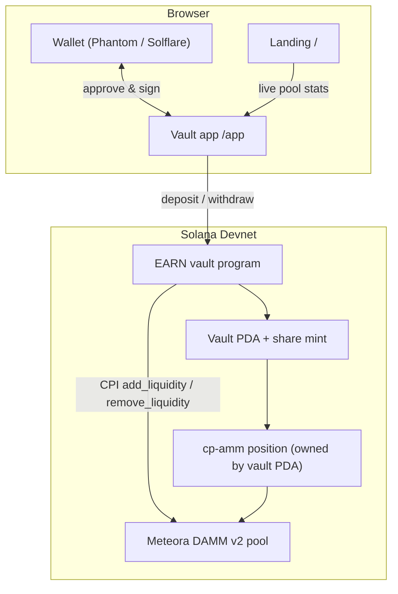

# EARN on Solana

**Deposit once. Earn on tokenized stocks.**

EARN is an automatic liquidity vault for tokenized stocks on Solana. You deposit
**USDC**, the vault provides that liquidity on **Meteora DAMM v2** and hands you
vault shares — no LP management, no rebalancing by hand. Redeeming your shares
pulls your share of the liquidity back out.

### 🔗 Live demo

| | URL |
| --- | --- |
| **App (HTTPS)** | **https://earnonsol.vercel.app** — landing · [/app](https://earnonsol.vercel.app/app) |
| Mirror (AWS S3) | http://earnonsol-app-91813308.s3-website.eu-central-1.amazonaws.com/ |
| Vault program (Devnet) | [`767woN2qJdFwFmw415arDXGVnk6JaTymGmzy6BSzc8YT`](https://solscan.io/account/767woN2qJdFwFmw415arDXGVnk6JaTymGmzy6BSzc8YT?cluster=devnet) |

> Devnet build. Connect a wallet set to **Devnet**, open `/app?env=dev`, grab test
> USDC from the in-app faucet, and deposit.

---

## Why it matters

Tokenized equities (xStocks) are live on Solana, but earning yield on them means
running concentrated-liquidity positions — choosing ranges, pairing tokens,
rebalancing. That is out of reach for most users. EARN turns it into a **single
USDC deposit**: the vault owns and manages one Meteora DAMM v2 position per asset,
and shares represent each depositor's slice of it.

## What it does

- **One-asset deposit** — deposit USDC, receive fungible vault shares.
- **Real Meteora DAMM v2 liquidity** — the vault program adds/removes liquidity in
  a live cp-amm position via CPI (not a simulation).
- **Proportional, on-chain accounting** — shares track the vault's position
  liquidity; redemptions return the proportional underlying tokens.
- **Six vaults** — NVIDIA, Tesla, Apple, S&P 500, Nasdaq 100, STONK (+ ZCAT / ALICE
  shown as coming soon), recovered 1:1 from the original product.
- **Live market data** — landing page shows real pool APR / liquidity / 24h fees.
- **Pausable** — management can pause deposits/withdrawals; upgrade authority is a
  separate role.

## How it works



**Deposit** — the app supplies the asset + USDC pair; the vault program CPIs
Meteora `add_liquidity` into its position and mints shares proportional to the
liquidity added (`shares = Δliquidity × supply ÷ liquidity_before`).

**Withdraw** — the vault burns the shares, CPIs Meteora `remove_liquidity` for
`liquidity × shares ÷ supply`, and returns the underlying tokens to the user.

The position NFT is owned by the vault PDA, so the program signs the Meteora CPIs
with its seeds. Share amounts are kept at token scale to stay within `u64` while
Meteora liquidity is Q64.64.

## Tech stack

- **Contract:** Rust + Anchor 0.31, CPI into Meteora cp-amm (`cpamdpZC…`).
- **Frontend:** React + TypeScript + Vite, `@solana/wallet-adapter`, `@solana/web3.js`.
- **Data:** live pool stats via public pool API; chain reads via configurable RPC.
- **Infra:** static multi-page build on Vercel (HTTPS) / AWS S3.

## Repository layout

| Directory | Purpose |
| --- | --- |
| [`app/`](app/) | The website — 1:1 landing (`/`) + React vault app (`/app/`), one Vite build. |
| [`program/`](program/) | Anchor vault program + Devnet scripts (setup, e2e, faucet). |
| [`website/`](website/) | Original static landing snapshot (reference). |
| [`video/`](video/) | Two-minute technical walkthrough. |

## Run it locally

**Frontend**
```bash
cd app
pnpm install
pnpm dev        # http://127.0.0.1:5173  (landing) · /app (vault app)
pnpm build      # static multi-page build → dist/
```
Optional: copy `app/.env.example` to `app/.env` and set `VITE_RPC_MAINNET` for
faster/reliable reads. The RPC token is never bundled into the public build.

**Program**
```bash
cd program
export DEVELOPER_DIR=/Library/Developer/CommandLineTools   # if the host Xcode is broken
anchor build
node scripts/e2e-meteora.mjs   # full Meteora deposit/withdraw on Devnet
```

## On-chain

| | Address |
| --- | --- |
| Vault program (Devnet) | `767woN2qJdFwFmw415arDXGVnk6JaTymGmzy6BSzc8YT` |
| Meteora DAMM v2 (cp-amm) | `cpamdpZCGKUy5JxQXB4dcpGPiikHawvSWAd6mEn1sGG` |
| Instructions | `initialize_vault`, `set_pool`, `deposit`, `withdraw`, `set_pause` |

**Verification** — [`program/scripts/e2e-meteora.mjs`](program/scripts/e2e-meteora.mjs)
runs the full path on Devnet: create a cp-amm pool + a vault-owned position →
`initialize_vault` → `set_pool` → `deposit` (CPI `add_liquidity`, shares minted) →
`withdraw` (CPI `remove_liquidity`, tokens returned). ✅

## Security & authority model

- **Vault-owned position** — the cp-amm position NFT is held by the vault PDA;
  only the program (signing with PDA seeds) can move its liquidity.
- **Validated CPI accounts** — pool / position / vault token accounts are checked
  against vault state and authority before every Meteora CPI.
- **Separate roles** — deposit/withdraw pause is a management action; program
  upgrade authority is a distinct key.
- **Checked math** — all share/liquidity arithmetic uses checked ops.

## Status & roadmap

- ✅ Landing page reproduced 1:1, with live pool data.
- ✅ Vault program deployed to Devnet; Meteora DAMM v2 CPI verified end-to-end.
- 🚧 Wiring the browser deposit/withdraw buttons to the v2 Meteora instruction
  (client-side deposit quote + cp-amm accounts); program flow already proven.
- ⏭️ USDC-only deposit with in-transaction swap; keeper-based range rebalancing;
  mainnet.

## Disclaimer

Independent hackathon project on **Devnet**. Not affiliated with Solana, Meteora,
xStocks, or the referenced companies. Not investment advice. Tokenized-stock
symbols are used for demonstration.
