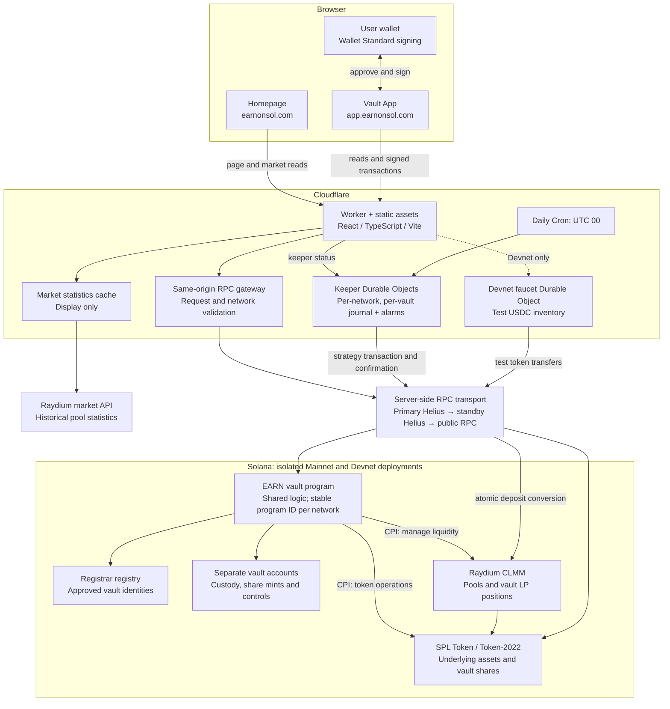

# EARN on Solana

A small, independent starting point for a project website and a native Solana program.

| Directory | Purpose |
| --- | --- |
| [`website/`](website/) | A static landing page with no build step. |
| [`contract/`](contract/) | A Rust program demonstrating authority-controlled account state. |

Each directory contains its own development instructions. This repository starts with fresh source and an independent Git history.

## System architecture

The diagram describes the current EARN system, reviewed against the deployment record dated **2026-09-24**, the active execution policies, and the deployed service structure. The two source directories in this repository are independent starter implementations, not the source of that deployment.

- **User transactions:** the App converts USDC into the selected pair and deposits it atomically. Vault shares represent the user's position. Redemption burns shares and returns the underlying asset plus USDC.
- **Automation:** each vault keeps its daily minute offset. The Keeper journals a signed transaction before submitting it once; pending signatures receive separate 45-second confirmation checks. Failure or expiry waits for the next daily strategy decision. Fee-only reinvestment requires at least 10 USDC of combined unclaimed fees per vault.
- **Data boundaries:** homepage market caching is for display. Accounting, quotes and strategy execution use chain reads. Idle App pages do not poll RPC. Provider failover does not rebroadcast a submitted Keeper transaction.
- **Authority boundaries:** registrar, vault management, Keeper and program upgrade authority are separate roles. Management can independently pause deposits, withdrawals and new strategy investment. Compatible upgrades preserve the program ID, vault accounts and existing shares.
- **Networks:** public pages default to Mainnet; `?env=dev` selects Devnet. Both networks have six published live vaults. The catalog is extensible rather than limited to six. The test-token faucet serves Devnet only.

## Status

Initial development. No website or on-chain program has been deployed from this repository.
