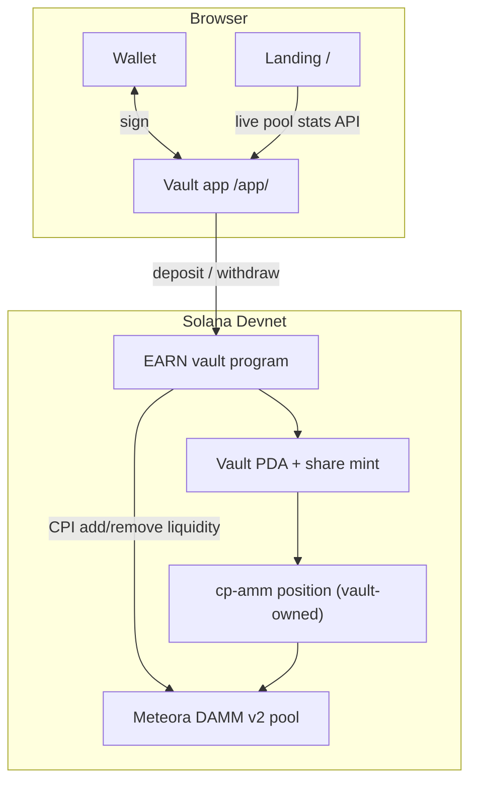

# EARN on Solana

Deposit USDC into automatic liquidity vaults for tokenized stocks on Solana.
Deposit once — the vault provides that liquidity on **Meteora DAMM v2** and hands
you vault shares. This repository contains the full reproduction: a pixel-faithful
landing page, a React vault app, and a Solana vault program deployed on Devnet
that integrates Meteora's cp-amm via CPI.

| Directory | Purpose |
| --- | --- |
| [`app/`](app/) | The website: 1:1 landing page (`/`) + React vault app (`/app/`), one Vite build. |
| [`program/`](program/) | Anchor vault program (Devnet) that CPIs into Meteora DAMM v2 (cp-amm). |
| [`website/`](website/) | Original static landing snapshot (reference). |
| [`video/`](video/) | Two-minute technical walkthrough. |

## Live

- Landing + app (AWS S3): http://earnonsol-app-91813308.s3-website.eu-central-1.amazonaws.com/
- Vault program (Devnet): `767woN2qJdFwFmw415arDXGVnk6JaTymGmzy6BSzc8YT`
- Meteora DAMM v2 (cp-amm): `cpamdpZCGKUy5JxQXB4dcpGPiikHawvSWAd6mEn1sGG`

## Website (`app/`)

React + Vite + TypeScript, Solana wallet-adapter.

```bash
cd app
pnpm install
pnpm dev          # http://127.0.0.1:5173  (landing)  ·  /app/ (vault app)
pnpm build        # static multi-page build in dist/
```

- `/` — landing page restored 1:1 from the original (real HTML/CSS), with **live**
  pool APR / liquidity / 24h fees injected from the public pool API.
- `/app/` — vault app: wallet connect, live pool stats, deposit / withdraw UI.
  `?vault=<id>` selects a vault, `?env=dev` uses Devnet, `?rpc=<url>` overrides RPC.
  (The browser deposit/withdraw calls are being rewired to the v2 Meteora
  instruction layout — the program-level flow is already verified by
  `program/scripts/e2e-meteora.mjs`.)
- Live pool data needs a real RPC only for wallet/chain reads; provide one via
  `.env` (`VITE_RPC_MAINNET=`, see `app/.env.example`). The token is never bundled
  into the public build.

## Vault program (`program/`)

An Anchor program: a vault that owns a single Meteora cp-amm position. Depositors
supply the asset + USDC pair; the vault adds that liquidity to its position via CPI
and mints shares proportional to the liquidity added. Redeeming shares removes the
proportional liquidity and returns the underlying tokens.

Instructions: `initialize_vault`, `set_pool`, `deposit`, `withdraw`, `set_pause`.

```bash
cd program
export DEVELOPER_DIR=/Library/Developer/CommandLineTools   # this host's Xcode is broken
anchor build
# deploy / setup / e2e scripts live in program/scripts
```

`program/scripts`:
- `cpamm-setup.mjs` — create a Meteora cp-amm pool and prove add/remove liquidity.
- `e2e-meteora.mjs` — full end-to-end: pool + vault-owned position → initialize_vault
  → set_pool → deposit (CPI add_liquidity) → withdraw (CPI remove_liquidity).
- `faucet-server.mjs` — local Devnet test-USDC faucet.

The Meteora deposit/withdraw path is verified end-to-end on Devnet.

## Architecture



- **Deposit:** the app supplies the asset + USDC pair; the vault CPIs cp-amm
  `add_liquidity` into its position and mints shares.
- **Withdraw:** the vault burns shares, CPIs cp-amm `remove_liquidity` for the
  proportional liquidity, and returns the underlying tokens.
- **Authority:** management can pause deposits/withdrawals; the program upgrade
  authority is a separate role.

## Status

- Landing page: reproduced 1:1, live pool data. ✅
- Vault program: deployed to Devnet, Meteora DAMM v2 CPI (deposit add-liquidity /
  withdraw remove-liquidity) verified end-to-end. ✅
- Vault app: UI complete; browser deposit/withdraw is being rewired to the v2
  Meteora instruction layout. 🚧

Devnet only — not deployed to mainnet.
