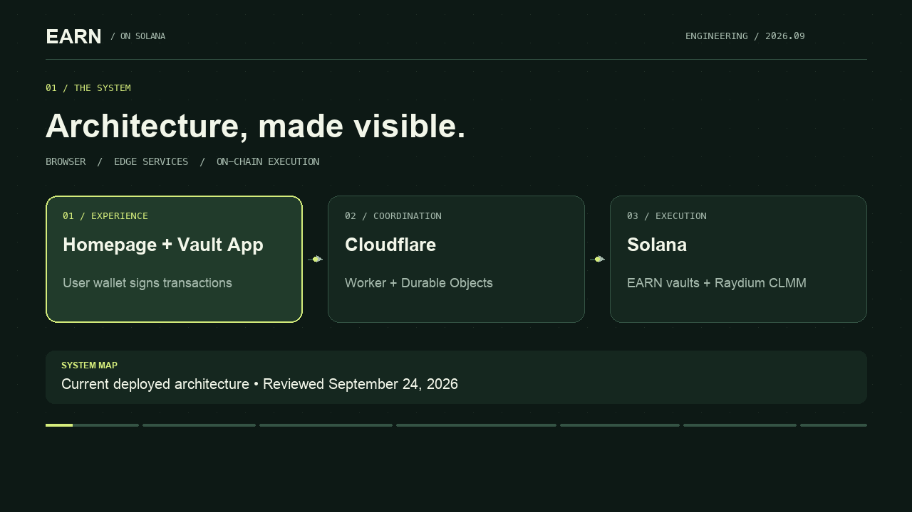

# Technical overview

A 120-second motion-graphics walkthrough with English narration and English subtitles. Production is based on [`storyboard.json`](storyboard.json).

[](earnonsol-technical-overview.mp4?raw=true)

[Watch or download the MP4](earnonsol-technical-overview.mp4?raw=true) · [English SRT](earnonsol-technical-overview.en.srt) · [Media manifest](media-info.json)

The architecture follows the current system map in the [repository README](../README.md#system-architecture), reviewed as of 2026-09-24. The website and counter code in this repository are independent examples. The video does not claim that those examples power the deployed product.

## Chapters

| Start | Topic |
| --- | --- |
| 00:00 | System overview |
| 00:14 | Interfaces and Cloudflare services |
| 00:31 | Deposits, liquidity and redemption |
| 00:51 | Daily Keeper execution |
| 01:15 | RPC transport and display data |
| 01:33 | Networks and authority roles |
| 01:50 | The independent source examples |

The narration is generated locally with the macOS Samantha voice. All diagrams and motion graphics are created from source; no production screenshots or private implementation code are included.

## Rebuild

Requirements: macOS with the Samantha voice, Python 3.10 or newer, FFmpeg and FFprobe on `PATH`, and Arial fonts. Pillow is pinned in `requirements.txt`.

From the repository root:

```sh
python3 -m venv .venv
.venv/bin/python -m pip install -r video/requirements.txt
.venv/bin/python video/render.py
```

The renderer generates a 1280 × 720 MP4 at 24 fps, a separate English SRT, a poster, and a media manifest. English captions are embedded in the picture for consistent playback; the separate SRT supports editing and reuse. Narration timing is aligned to each chapter; intermediate speech files stay in the ignored `video/.build/` directory.

For a quick layout review, use `--stills-only`. Use `--audio-only` to build narration and subtitle timing without encoding video. `--work-dir` and `--output-dir` accept custom directories. Narration tempo is bounded, and overlong text fails layout validation instead of being silently clipped.

The rendering primitives follow the [Pillow ImageDraw API](https://pillow.readthedocs.io/en/stable/reference/ImageDraw.html); audio timing and MP4 encoding use [FFmpeg](https://ffmpeg.org/ffmpeg-filters.html).

## Delivered media

The MP4 contains 2,880 H.264 frames, a 48 kHz English AAC narration track, and 27 English captions over exactly 120 seconds. The captions are also provided in the separate SRT. The video's SHA-256 digest is recorded in `media-info.json`.

Validation covered full-stream decoding, duration, audio levels, subtitle timing and sampled frames from all seven chapters. This is an architecture explainer with synthetic narration, not a recording of live transactions.
